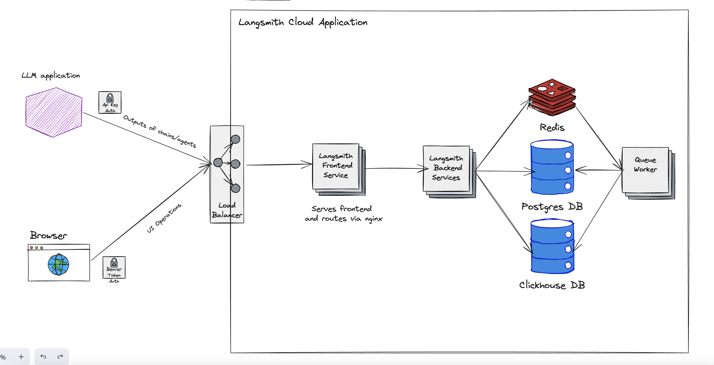

# Self-hosted LangSmith

:::important Enterprise License Required
Self-hosted LangSmith is an add-on to the Enterprise Plan designed for our largest, most security-conscious customers. See our [pricing page](https://www.langchain.com/pricing) for more detail, and contact us at sales@langchain.dev if you want to get a license key to trial LangSmith in your environment.
:::

LangSmith can be run via Kubernetes (recommended) or Docker in a Cloud environment that you control.

The LangSmith Service consists of 3 major components that are deployed behind an application load balancer:

- frontend
- backend
- queue

## Architectual overview

### Frontend

The frontend serves the LangSmith UI and is responsible for making API calls on behalf of a user navigating the LangSmith application via a browser.

### Backend

The backend services LangSmith API calls and is responsible for interacting with the settings datastore (Postgres), the in-memory caching engine (Redis), and the the runs and feedback datastore (ClickHouse). When a trace is submitted to LangSmith from your LLM application, it uses an API key to submit run data detailing the interaction of the application with the LLM including inputs, outputs and metadata. This API call is sent through the load balancer to the LangSmith backend, where the request is checked for authentication, authorization, and data integrity. Once confirmed, the run data is sent to the queue.

### Queue

The queue handles incoming runs and feedback to ensure that they are ingested and persisted into the runs and feedback datastore asychronously, handling checks for data integrity and ensuring successful insert into the datastore, handling retries in situations such as database errors or the temporary inability to connect to the database.

## Frequently Asked Questions

### Can I bring my own Postgres & Redis instance? Do I need to?

You can supply your own Postgres and Redis instances, subject to some limitations. _We strongly recomend this_ so that you can take advantage of existing sizing, scaling, backup provisions, and performance monitoring of these services that your organization may already have.

For Postgres, we support Postgres v14 and higher.

For Redis, we support Redis versions >= 6. We also do not support sharded/clustered Redis, though you **can** point to a single node in a Redis cluster.

### How do I set up authentication?

The default LangSmith deployment is an unauthenticated instance. However, we strongly recommend you configure authentication for the service. We support single-sign on authentication via an OIDC Authorization Code with PKCE flow. Most OIDC compliant identity solutions support this (e.g. Okta, Azure), though Google's OIDC implementation is a notable exception.

Once you have worked with your Identity Provider to configure OIDC+PKCE, details can be found in the Kubernetes or Docker reference docs on how to set the appropriate values in configuration files.

What is ClickHouse and why do I need it?

ClickHouse is a highly scalable, open-source column-oriented database management system that allows generating analytical data reports in real-time using SQL queries. Given the large potential volume of traces that would be associated with logging large percentages (or even 100%) of application-LLM interactions, such when storing traces for compliance and auditability purposes,
and associated run data that can be populated into LangSmith, meant needing to support high throughput ingestion as well as fast filtering for drill-downs on charts in the user interface. We learned that postgres was unable to support LangSmith's analytical workloads at scale. ClickHouse is specifically designed to handle the kinds of analytical workloads that LangSmith generates.

We include an open-source, single node instance of ClickHouse that writes to a persistent volume that you supply as part of your configuration. If you have restrictions on running stateful services or accessing persistent volumes within your environment, we'd like to understand those requirements better but notably we do support ClickHouse Cloud as well.

For more information about how and why we chose ClickHouse you can learn more [here](https://clickhouse.com/blog/langchain-why-we-choose-clickhouse-to-power-langchain)

How do I scale my resource?

[We should write a sizing guide and link to it here]

Has LangSmith been load tested, what scale can you handle?

The same code that we use in deploying LangSmith locally is used to power our SaaS service, which currently receives > xxx M traces per day.

### What is the OpenAI key used for? Do I need to supply it in the config?

The OpenAI key is used for our natural language search feature as well as evaluators. Not that this global setting is optional and you can specify an OpenAI key interactively in the application as well.
