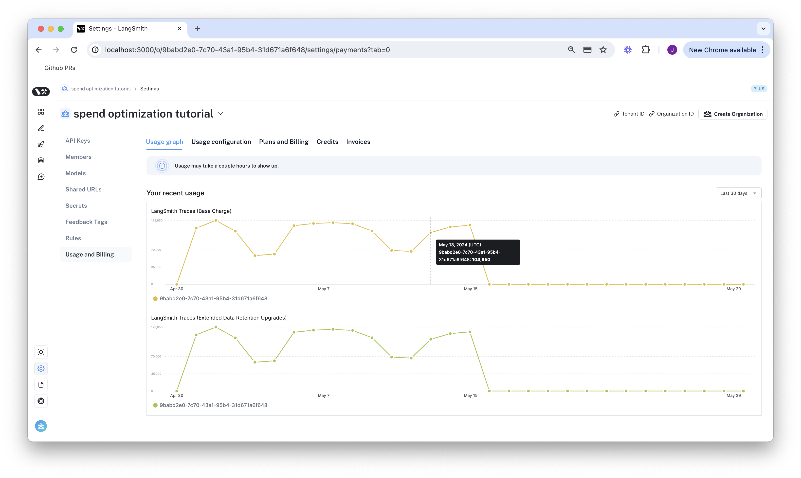
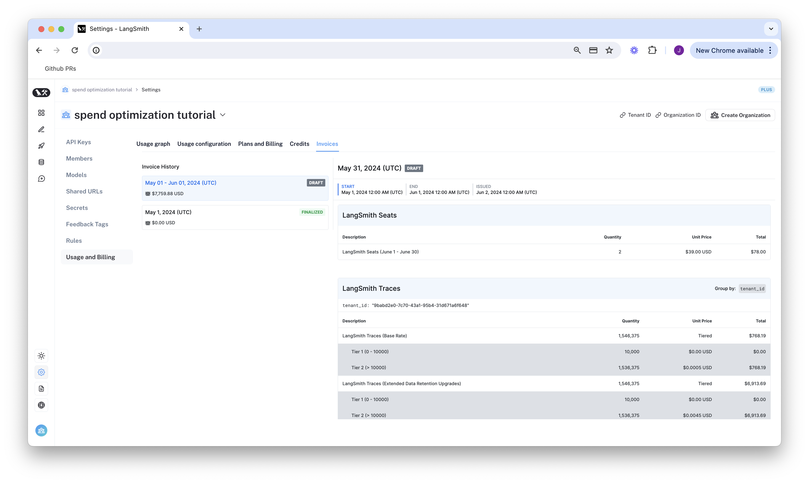
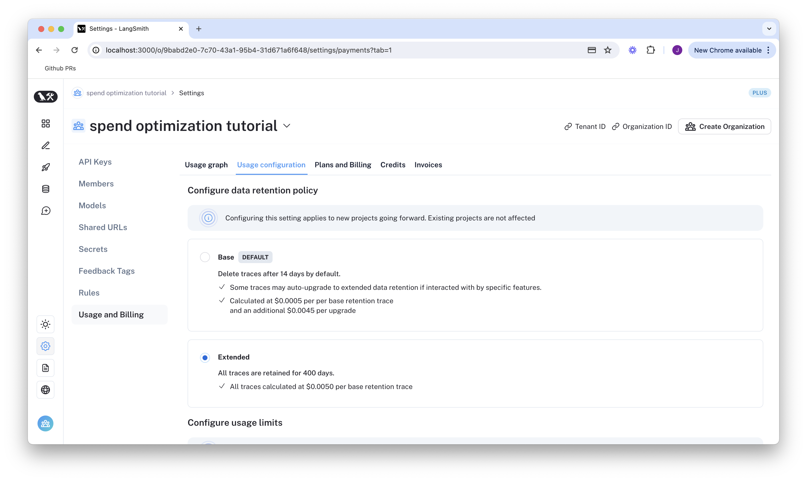
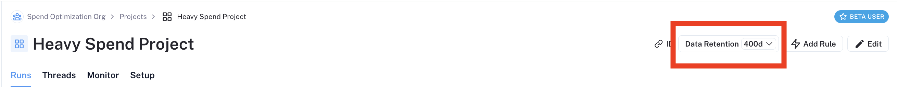
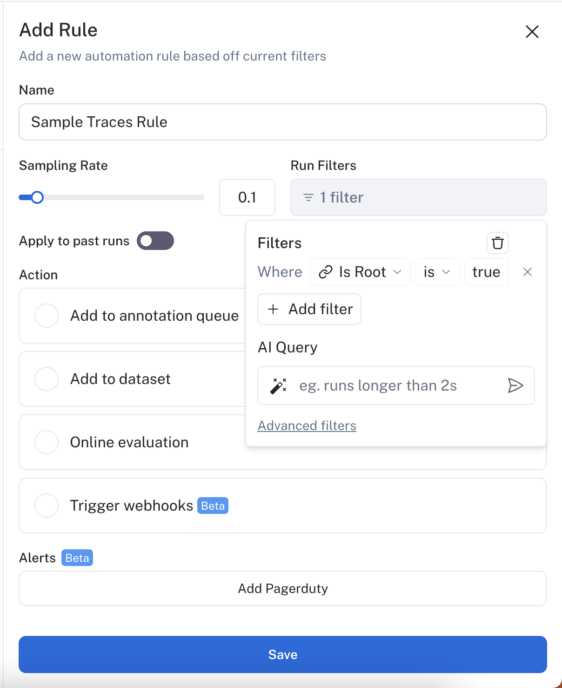
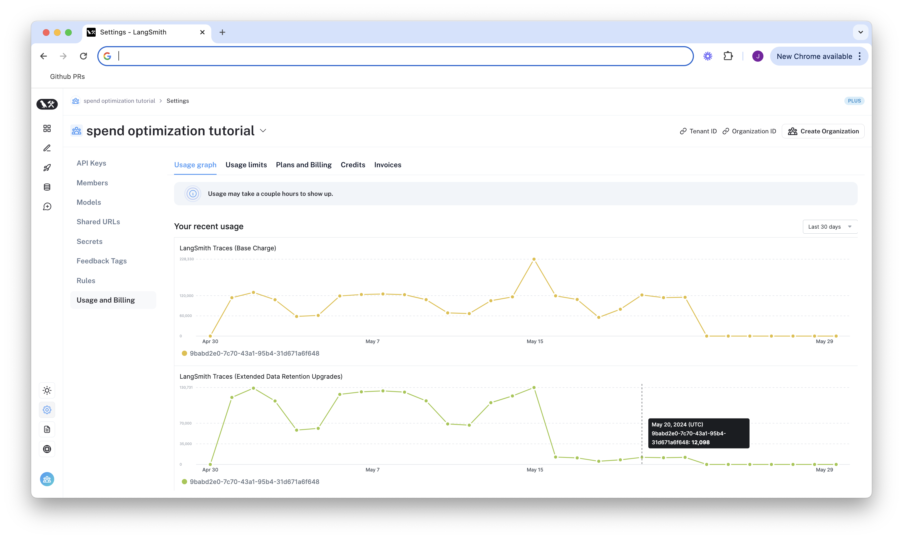
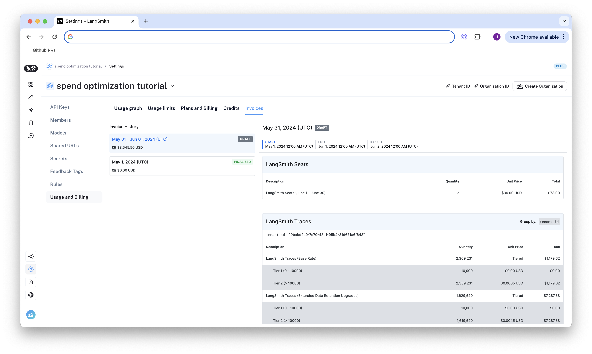
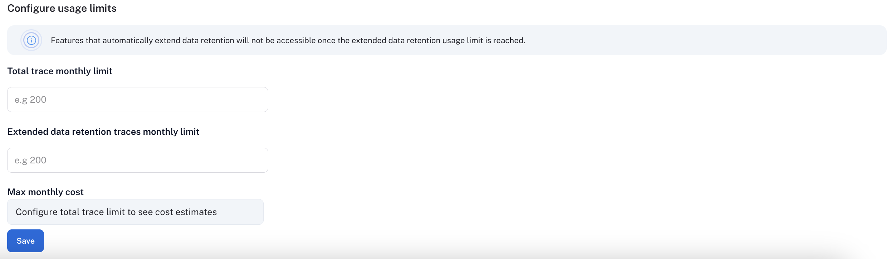
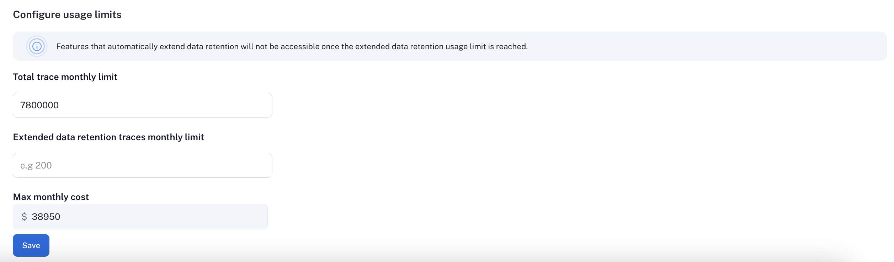
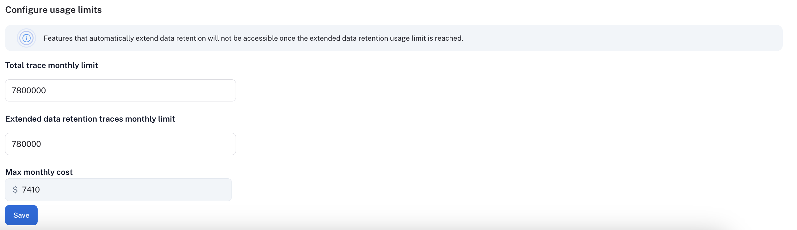

import {
  CodeTabs,
  python,
  typescript,
  shell,
} from "@site/src/components/InstructionsWithCode";

# Optimize tracing spend on LangSmith

This tutorial walks through optimizing your spend on LangSmith. In it, we will learn how to optimize existing spend
and prevent future overspend on a realistic real-world example. 

## Tutorial background
In this tutorial, we will use an existing LangSmith tenant with high usage. Concepts can be transferred to your own tenant. 

## Understand your current usage
The first step of any optimization process is to understand current usage. LangSmith gives two ways to do this: Usage Graph 
and Invoices.

### Usage Graph
The usage graph lets us examine how much of each usage based pricing metric we have consumed lately. It does not give insight
into spend. 

We can navigate to the Usage Graph under `Settings` -> `Usage and Billing` -> `Usage Graph`. 

We see in the graph above that there are two usage metrics that LangSmith charges for, LangSmith Traces (Base Charge) and 
LangSmith Traces (Extended Data Retention Upgrades). The first metric tracks all traces that you send to LangSmith. The second
tracks all traces that have our Extended 400 Day Data Retention. For more details, see [TODO: LINK]

### Invoices
We head to the `Invoices` tab to see how our usage translates into spend in the current billing period. 

On the above invoice, we see that extended data retention traces upgrades make up the majority of our nearly $8,000 bill for the
first two weeks of May. Upgrades occur for two reasons: 

1. you use extended data retention tracing 
2. you use base data retention tracing, and use a feature that automatically extends the data retention of a trace

Given that the number of total traces per day is equal to the number of extended retention traces per day, it's most likely the 
case that this org is using extended data retention tracing everywhere. As such, we start by optimizing our retention settings.

## Optimization 1: manage data retention

LangSmith charges differently based on a traces' data retention [link], where short-lived traces are 
an order of magnitude less expensive than ones that last for a long time. In this optimization, we will
show how to get optimal settings for data retention without sacrificing historical observability, and 
show the effect it has on our bill.

### Change org level retention defaults for new projects 
We navigate to the `Usage Limits` tab, and look at our organization level retention settings. Modifying this setting affects all **new projects** that are
created going forward.

:::note 
For backwards compatibility, older organizations may have this defaulted to Extended. Organizations created after [TODO: DATE]
have this defaulted to Base.
:::

### Change project level retention defaults
Our existing projects have not changed their data retention settings, so we can change these on the individual project pages. 

We navigate to `Projects` -> `<your project name>`, click the data retention drop down, and modify it to base retention. As 
with the organization level setting, this will only affect retention (and pricing) for traces going forward.

### Optional: keep around 10% of traces for extended data retention
We may not want all our traces to expire after 14 days if we care about historical debugging. As such, we can take advantage
of LangSmith's built in ability to do server side sampling for extended data retention. 

LangSmith automatically upgrades the data retention for any trace that matches a run rule in our automations product. On the
projects page, click `Add Rule`, and configure the rule as follows:

Run rules match on runs rather than traces, so we add a filter condition to only match the "root" run. This is distinct per trace, 
so our 10% sampling will upgrade 10% of traces, not 10% of runs, which could correspond to more than 10% of traces. 

:::note
If you want to keep a subset of traces for longer than 400 days for data collection purposes, you can create another run
rule that sends some runs to a dataset of your choosing.
:::

Choosing the right percentage of runs to sample depends on your use case. We arbitrarily picked 10% of runs here, but will
leave it to the user to find the right value that balances collecting rare events and cost constraints.

### See results after 7 days
While the total amount of traces per day stayed the same, the extended data retention traces as expected was cut heavily.

This translates to the invoice, where we've only added an extra $800 in spend in the last week, meaning we've cut weekly
costs by nearly 80%! 

## Optimization 2: limit usage

In the previous section, we managed data retention settings to *optimize existing spend*. In this section, we will
use usage limits to *prevent future overspend*. 

LangSmith has two usage limits: total traces and extended retention traces. These correspond to the two metrics we've 
been tracking on our usage graph. We can use these in tandem to have granular control over spend. 

To set limits, we navigate to `Settings` -> `Usage and Billing` -> `Usage Limits`. We see our two limits appear, along
with a cost estimate at the bottom:

### Picking a good all traces limit 
Picking the right "all traces" limit depends on the expected load of traces that you will send to LangSmith. For example,
our gen AI application is called between 1.2-1.5 times per second, and each API request has a trace associated with it,
meaning we log around 100,000-130,000 traces per day. We expect to double in size in the near future, so we'd ideally like to set our limit
to `2 * 130,000 * 30 = 7,800,000` traces per month.

:::note
When set without the all traces limit, the maximum cost estimator assumes that all traces are using extended data retention.
:::

### Cutting maximum spend with an extended data retention limit
If we are not a big enterprise, we may shutter at the ~$40k per month bill.

We saw from Optimization 1 that the easiest way to cut cost was through data retention. The same can be said for limits. 
If we only want to keep ~10% of traces to be around more than 14 days, we can set a limit on the maximum high retention
traces we can keep. That would be `.10 * 7,800,000 = 780,000`. 

As we can see, the maximum cost is cut from ~40k per month to ~7.5k per month. This lets us be confident that new 
users on the platform will not accidentally cause cost to balloon.

:::note
The extended data retention limit can cause features other than traces to stop working once reached. If you plan to 
use this feature, please read more about its functionality here [TODO: link].
:::

## Summary
In this tutorial, we learned how to:

1. Cut down our existing costs with data retention policies
2. Prevent future overspend with usage limits

If you have questions about further optimizing your spend, please reach out to support@langchain.dev. 