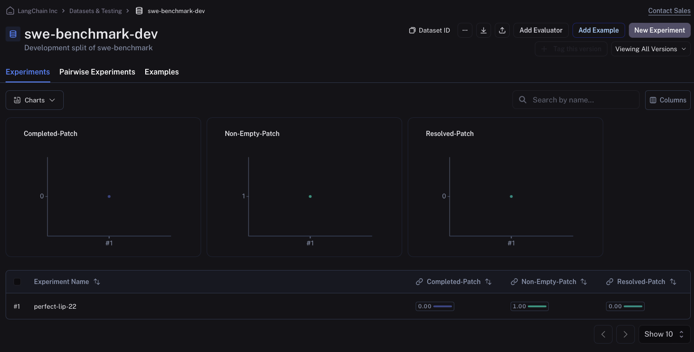

# Running SWE-Benchmark with LangSmith

SWE-Benchmark is one of the most popular (and difficult!) benchmarks for developers to test their coding agents against. In this walkthrough we will show you how to load the SWE-benchmark dataset into LangSmith and easily run evals on it, allowing you to have much better visibility into your agents behaviour then using the off-the-shelf SWE-benchmark eval suite. This allows you to pin specific problems quicker and iterate on your agent rapidly to improve performance!

## Loading the data

To load the data, we will pull the `dev` split from Hugging Face, but for your use case you may wish to pull one of the `test`, or `train` splits, and if you want to combine multiple splits you can use `pd.concat`.

```python
import pandas as pd

splits = {'dev': 'data/dev-00000-of-00001.parquet', 'test': 'data/test-00000-of-00001.parquet', 'train': 'data/train-00000-of-00001.parquet'}
df = pd.read_parquet("hf://datasets/princeton-nlp/SWE-bench/" + splits["dev"])
```

### Editing the 'version' column

:::note
This is a very important step! If you skip, the rest of the code WILL NOT WORK!
:::

The `version` column contains all string values but all are in float format so they get converted to floats when you upload the CSV to create a LangSmith dataset. Although you can convert the values to strings during your experiments, the issue arises with values like `"0.10"`. When getting converted to a float, you get the value `0.1`, which would become `"0.1"` if you converted it to a string - causing a key error during execution of your proposed patch.

In order to fix this, we need LangSmith to stop trying to convert the `version` column to floats. In order to do this, we can just append a string prefix to each of them that is not float compatible. We then need to split on this prefix when doing evaluation to get the actual `version` value. The prefix we choose here is the string `"version:"`.

:::note
The ability to select column types when uploading a CSV to LangSmith will be added in the future to avoid having to use this workaround.
:::

```python
df['version'] = df['version'].apply(lambda x: f"version:{x}")
```

## Upload the data to LangSmith

### Save to CSV

To upload the data to LangSmith, we first need to save it to a CSV, which we can do using the `to_csv` function provided by pandas. Make sure to save this file somewhere that is easily accesible to you.

```python
df.to_csv("./../swe-benchmark.csv",index=False)
```

### Upload CSV to LangSmith Manually

We are now ready to upload the CSV to LangSmith. Once you are on the LangSmith website (smith.langchain.com), go to the `Datasets & Testing` tab on the left side navigation bar, and then click the `+ New Dataset` button in the top right corner.

Then click the `Upload CSV` button on the top, and select the CSV file you saved in the previous step. You can then give your dataset a name and description.

Next, select `Key-Value` as the dataset type. Lastly head to the `Create Schema` section and add ALL OF THE KEYS as `Input fields`. There are no `Output fields` in this example because our evaluator is not comparing against a reference, but instead will run the output of our experiments in docker containers to ensure that the code actually solves the PR issue.

Once you have populated the `Input fields` (and left the `Output fields` empty!) you can click the blue `Create` button in the top right corner, and your dataset will be created!

### Upload CSV to LangSmith Programatically

Alternatively you can upload your csv to LangSmith using the sdk as shown in the code block below:

```python
dataset = client.upload_csv(
    csv_file="./../swe-benchmark-dev.csv",
    input_keys=list(df.columns),
    output_keys=[],
    name="swe-bench-programatic-upload",
    description="SWE-benchmark dataset",
    data_type="kv"
)
```

### Create dataset split for quicker testing

Since running the SWE-benchmark evaluator takes a long time when run on all examples, you can create a "test" split for quickly testing the evaluator and your code. Read [this guide](https://docs.smith.langchain.com/how_to_guides/datasets/manage_datasets_in_application#create-and-manage-dataset-splits) to learn more about managing dataset splits, or watch this short video that shows how to do it (to get to the starting page of the video, just click on your dataset created above and go to the `Examples` tab):

import creating_split from "./static/creating_split.mp4";

<video
  controls
  autoPlay
  muted
  style={{ width: "100%", borderRadius: "8px", overflow: "hidden" }}
>
  <source src={creating_split} />
</video>

## Running our prediction function

Running evaluation over SWE-benchmark works a little differently than most evals you will typically run on LangSmith since we don't have a reference output. Because of this, we first generate all of our outputs without running an evaluator (note how the `evaluate` call doesn't have the `evaluators` parameter set). In this case we returned a dummy predict function, but you can insert your agent logic inside the `predict` function to make it work as intended.

```python
from langsmith.evaluation import evaluate
from langsmith import Client

client = Client()

def predict(inputs: dict):
    return {"instance_id":inputs['instance_id'],"model_patch":"None","model_name_or_path":"test-model"}

result = evaluate(
    predict,
    data=client.list_examples(dataset_id="a9bffcdf-1dfe-4aef-8805-8806f0110067",splits=["test"]),
)
```

    View the evaluation results for experiment: 'perfect-lip-22' at:
    https://smith.langchain.com/o/ebbaf2eb-769b-4505-aca2-d11de10372a4/datasets/a9bffcdf-1dfe-4aef-8805-8806f0110067/compare?selectedSessions=182de5dc-fc9d-4065-a3e1-34527f952fd8


    3it [00:00, 24.48it/s]

## Evaluating our predictions using SWE-benchmark

Now we can run the following code to run the predicted patches we generated above in Docker. This code is edited slightly from the `SWE-bench` [run_evaluation.py](https://github.com/princeton-nlp/SWE-bench/blob/main/swebench/harness/run_evaluation.py) file.

Basically, the code sets up docker images to run the predictions in parallel, which greatly reduces the time needed for evaluation. This screenshot explains the basics of how `SWE-bench` does evaluation under the hood. To understand it in full, make sure to read through the code in the [GitHub repository](https://github.com/princeton-nlp/SWE-bench).


The function `convert_runs_to_langsmith_feedback` converts the logs generated by the docker file into a nice .json file that contains feedback in the typical key/score method of LangSmith.

```python
from swebench.harness.run_evaluation import run_instances
import resource
import docker
from swebench.harness.docker_utils import list_images, clean_images
from swebench.harness.docker_build import build_env_images
from pathlib import Path
import json
import os

RUN_EVALUATION_LOG_DIR = Path("logs/run_evaluation")
LANGSMITH_EVALUATION_DIR = './langsmith_feedback/feedback.json'

def convert_runs_to_langsmith_feedback(
        predictions: dict,
        full_dataset: list,
        run_id: str
    ) -> float:
    """
    Convert logs from docker containers into LangSmith feedback.

    Args:
        predictions (dict): Predictions dict generated by the model
        full_dataset (list): List of all instances
        run_id (str): Run ID
    """
    feedback_for_all_instances = {}

    for instance in full_dataset:
        feedback_for_instance = []
        instance_id = instance['instance_id']
        prediction = predictions[instance_id]
        if prediction.get("model_patch", None) in ["", None]:
            # Prediction returned an empty patch
            feedback_for_all_instances[prediction['run_id']] = [{"key":"non-empty-patch","score":0},
                                                                {"key":"completed-patch","score":0},
                                                                {"key":"resolved-patch","score":0}]
            continue
        feedback_for_instance.append({"key":"non-empty-patch","score":1})
        report_file = (
            RUN_EVALUATION_LOG_DIR
            / run_id
            / prediction["model_name_or_path"].replace("/", "__")
            / prediction['instance_id']
            / "report.json"
        )
        if report_file.exists():
            # If report file exists, then the instance has been run
            feedback_for_instance.append({"key":"completed-patch","score":1})
            report = json.loads(report_file.read_text())
            # Check if instance actually resolved the PR
            if report[instance_id]["resolved"]:
                feedback_for_instance.append({"key":"resolved-patch","score":1})
            else:
                feedback_for_instance.append({"key":"resolved-patch","score":0})
        else:
            # The instance did not run succesfully
            feedback_for_instance += [{"key":"completed-patch","score":0},{"key":"resolved-patch","score":0}]
        feedback_for_all_instances[prediction['run_id']] = feedback_for_instance

    os.makedirs(os.path.dirname(LANGSMITH_EVALUATION_DIR), exist_ok=True)
    with open(LANGSMITH_EVALUATION_DIR, 'w') as json_file:
        json.dump(feedback_for_all_instances, json_file)

def evaluate_predictions(
        dataset: list,
        predictions: list,
        max_workers: int,
        force_rebuild: bool,
        cache_level: str,
        clean: bool,
        open_file_limit: int,
        run_id: str,
        timeout: int,
    ):
    """
    Run evaluation harness for the given dataset and predictions.
    """
    # set open file limit
    assert len(run_id) > 0, "Run ID must be provided"
    resource.setrlimit(resource.RLIMIT_NOFILE, (open_file_limit, open_file_limit))
    client = docker.from_env()

    existing_images = list_images(client)
    print(f"Running {len(dataset)} unevaluated instances...")
    # build environment images + run instances
    build_env_images(client, dataset, force_rebuild, max_workers)
    run_instances(predictions, dataset, cache_level, clean, force_rebuild, max_workers, run_id, timeout)

    # clean images + make final report
    clean_images(client, existing_images, cache_level, clean)

    convert_runs_to_langsmith_feedback(predictions,dataset,run_id)
```

```python
dataset = []
predictions = {}
for res in result:
    predictions[res['run'].outputs['instance_id']] = {**res['run'].outputs,**{"run_id":str(res['run'].id)}}
    dataset.append(res['run'].inputs['inputs'])
for d in dataset:
    d['version'] = d['version'].split(":")[1]
```

```python
evaluate_predictions(dataset,predictions,max_workers=8,force_rebuild=False,cache_level="env",clean=False \
                     ,open_file_limit=4096,run_id="test",timeout=1_800)
```

    Running 3 unevaluated instances...
    Base image sweb.base.arm64:latest already exists, skipping build.
    Base images built successfully.
    Total environment images to build: 2


    Building environment images: 100%|██████████| 2/2 [00:47<00:00, 23.94s/it]


    All environment images built successfully.
    Running 3 instances...


      0%|          | 0/3 [00:00<?, ?it/s]

    Evaluation error for sqlfluff__sqlfluff-884: >>>>> Patch Apply Failed:
    patch unexpectedly ends in middle of line
    patch: **** Only garbage was found in the patch input.

    Check (logs/run_evaluation/test/test-model/sqlfluff__sqlfluff-884/run_instance.log) for more information.
    Evaluation error for sqlfluff__sqlfluff-4151: >>>>> Patch Apply Failed:
    patch unexpectedly ends in middle of line
    patch: **** Only garbage was found in the patch input.

    Check (logs/run_evaluation/test/test-model/sqlfluff__sqlfluff-4151/run_instance.log) for more information.
    Evaluation error for sqlfluff__sqlfluff-2849: >>>>> Patch Apply Failed:
    patch: **** Only garbage was found in the patch input.
    patch unexpectedly ends in middle of line

    Check (logs/run_evaluation/test/test-model/sqlfluff__sqlfluff-2849/run_instance.log) for more information.


    100%|██████████| 3/3 [00:30<00:00, 10.04s/it]

    All instances run.
    Cleaning cached images...
    Removed 0 images.

## Sending Evaluation to LangSmith

Now, we can actually send our evaluation feedback to LangSmith by using the `evaluate_existing` function. Our evaluate function is incredibly simple in this case, because the `convert_runs_to_langsmith_feedback` function above made our life very easy by saving all the feedback to a single file.

```python
from langsmith.evaluation import evaluate_existing
from langsmith.schemas import Example, Run

def swe_bench_evaluator(run: Run, example: Example):
    with open(LANGSMITH_EVALUATION_DIR, 'r') as json_file:
        langsmith_eval = json.load(json_file)
    return {"results": langsmith_eval[str(run.id)]}

experiment_name = result.experiment_name
evaluate_existing(experiment_name, evaluators=[swe_bench_evaluator])
```

    View the evaluation results for experiment: 'perfect-lip-22' at:
    https://smith.langchain.com/o/ebbaf2eb-769b-4505-aca2-d11de10372a4/datasets/a9bffcdf-1dfe-4aef-8805-8806f0110067/compare?selectedSessions=182de5dc-fc9d-4065-a3e1-34527f952fd8


    3it [00:01,  1.52it/s]


    <ExperimentResults perfect-lip-22>

After running, we can go to the experiments tab of our dataset, and check that our feedback keys were properly assigned. If they were, you should see something that resembles the following image:


