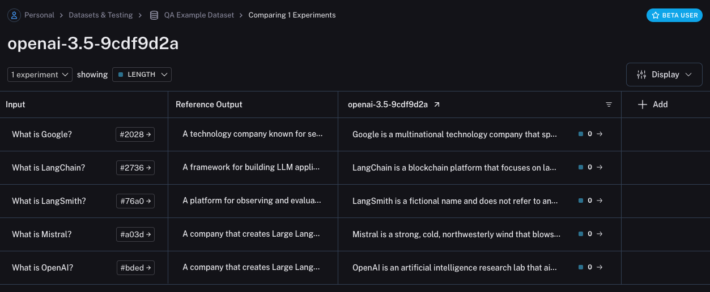
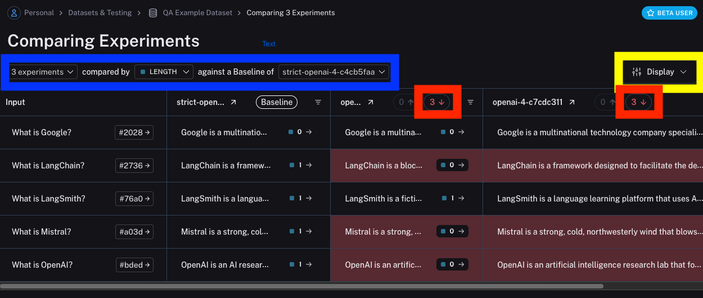
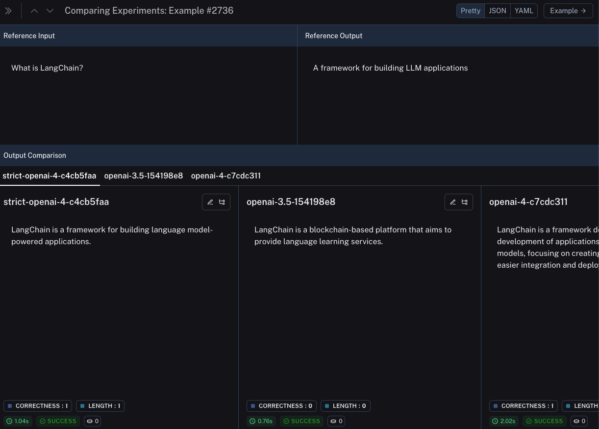

# Evaluate your LLM application

It can be hard to measure the performance of your application with respect to criteria important you or your users.
However, doing so is crucial, especially as you iterate on your application.
In this guide we will go over how to test and evaluate your application.
This allows you to measure how well your application is performing over a **fixed** set of data.
Being able to get this insight quickly and reliably will allow you to iterate with confidence.

At a high level, in this tutorial we will go over how to:

- _Create an initial golden dataset to measure performance_
- _Define metrics to use to measure performance_
- _Run evaluations on a few different prompts or models_
- _Compare results manually_
- _Track results over time_
- _Set up automated testing to run in CI/CD_

For more information on the evaluation workflows LangSmith supports, check out the [how-to guides](../how_to_guides).

Lots to cover, let's dive in!

## Create a dataset

The first step when getting ready to test and evaluate your application is to define the datapoints you want to evaluate.
There are a few aspects to consider here:

- What should the schema of each datapoint be?
- How many datapoints should I gather?
- How should I gather those datapoints?

**Schema:** Each datapoint should consist of, at the very least, the inputs to the application.
If you are able, it is also very helpful to define the expected outputs - these represent what you would expect a properly functioning application to output.
Often times you cannot define the perfect output - that's okay! Evaluation is an iterative process.
Sometimes you may also want to define more information for each example - like the expected documents to fetch in RAG, or the expected steps to take as an agent.
LangSmith datasets are very flexible and allow you to define arbitrary schemas.

**How many:** There's no hard and fast rule for how many you should gather.
The main thing is to make sure you have proper coverage of edge cases you may want to guard against.
Even 10-50 examples can provide a lot of value!
Don't worry about getting a large number to start - you can (and should) always add over time!

**How to get:** This is maybe the trickiest part.
Once you know you want to gather a dataset... how do you actually go about it?
For most teams that are starting a new project, we generally see them start by collecting the first 10-20 datapoints by hand.
After starting with these datapoints, these datasets are generally _living_ constructs and grow over time.
They generally grow after seeing how real users will use your application, seeing the pain points that exist, and then moving a few of those datapoints into this set.
There are also methods like synthetically generating data that can be used to augment your dataset.
To start, we recommend not worrying about those and just hand labeling ~10-20 examples.

Once you've got your dataset, there are a few different ways to upload them to LangSmith.
For this tutorial, we will use the client, but you can also upload via the UI (or even create them in the UI).

For this tutorial, we will create 5 datapoints to evaluate on.
We will be evaluating a question-answering application.
The input will be a question, and the output will be an answer.
Since this is a question-answering application, we can define the expected answer.
Let's show how to create and upload this dataset to LangSmith!

```python
from langsmith import Client

client = Client()

# Define dataset: these are your test cases
dataset_name = "QA Example Dataset"
dataset = client.create_dataset(dataset_name)
client.create_examples(
    inputs=[
        {"question": "What is LangChain?"},
        {"question": "What is LangSmith?"},
        {"question": "What is OpenAI?"},
        {"question": "What is Google?"},
        {"question": "What is Mistral?"},
    ],
    outputs=[
        {"answer": "A framework for building LLM applications"},
        {"answer": "A platform for observing and evaluating LLM applications"},
        {"answer": "A company that creates Large Language Models"},
        {"answer": "A technology company known for search"},
        {"answer": "A company that creates Large Language Models"},
    ],
    dataset_id=dataset.id,
)
```

Now, if we go the LangSmith UI and look for `QA Example Dataset` in the `Datasets & Testing` page,
when we click into it we should see that we have five new examples.


## Define metrics

After creating our dataset, we can now define some metrics to evaluate our responses on.
Since we have an expected answer, we can compare to that as part of our evaluation.
However, we do not expect our application to output those **exact** answers, but rather something that is similar.
This makes our evaluation a little trickier.

In addition to evaluating correctness, let's also make sure our answers are short and concise.
This will be a little easier - we can define a simple Python function to measure the length of the response.

Let's go ahead and define these two metrics.

For the first, we will use an LLM to **judge** whether the output is correct (with respect to the expected output).
This **LLM-as-a-judge** is relatively common for cases that are too complex to measure with a simple function.
We can define our own prompt and LLM to use for evaluation here:

```python
from langchain_anthropic import ChatAnthropic
from langchain_core.prompts.prompt import PromptTemplate
from langsmith.evaluation import LangChainStringEvaluator

_PROMPT_TEMPLATE = """You are an expert professor specialized in grading students' answers to questions.
You are grading the following question:
{query}
Here is the real answer:
{answer}
You are grading the following predicted answer:
{result}
Respond with CORRECT or INCORRECT:
Grade:
"""

PROMPT = PromptTemplate(
    input_variables=["query", "answer", "result"], template=_PROMPT_TEMPLATE
)
eval_llm = ChatAnthropic(temperature=0.0)

qa_evaluator = LangChainStringEvaluator("qa", config={"llm": eval_llm, "prompt": PROMPT})
```

:::note
This example assumes you have the `ANTHROPIC_API_KEY` environment variable set. You can just as easily run this example with OpenAI by replacing `ChatAnthropic` with `ChatOpenAI` from `langchain_openai`.
:::

For evaluating the length of the response, this is a lot easier!
We can just define a simple function that checks whether the actual output is less than 2x the length of the expected result.

```python
from langsmith.schemas import Run, Example

def evaluate_length(run: Run, example: Example) -> dict:
    prediction = run.outputs.get("output") or ""
    required = example.outputs.get("answer") or ""
    score = int(len(prediction) < 2 * len(required))
    return {"key":"length", "score": score}
```

## Run Evaluations

Great! So now how do we run evaluations?
Now that we have a dataset and evaluators, all that we need is our application!
We will build a simple application that just has a system message with instructions on how to respond and then passes it to the LLM.
We will build this using the OpenAI SDK directly:

```python
import openai

openai_client = openai.Client()

def my_app(question):
    return openai_client.chat.completions.create(
        model="gpt-3.5-turbo",
        temperature=0,
        messages=[
            {
                "role": "system",
                "content": "Respond to the users question in a short, concise manner (one short sentence)."
            },
            {
                "role": "user",
                "content": question,
            }
        ],
    ).choices[0].message.content
```

Before running this through LangSmith evaluations, we need to define a simple wrapper that maps the input keys from our dataset to the function we want to call,
and then also maps the output of the function to the output key we expect.

```python
def langsmith_app(inputs):
    output = my_app(inputs["question"])
    return {"output": output}
```

Great!
Now we're ready to run evaluation.
Let's do it!

```python
from langsmith.evaluation import evaluate

experiment_results = evaluate(
    langsmith_app, # Your AI system
    data=dataset_name, # The data to predict and grade over
    evaluators=[evaluate_length, qa_evaluator], # The evaluators to score the results
    experiment_prefix="openai-3.5", # A prefix for your experiment names to easily identify them
)
```

This will output a URL. If we click on it, we should see results of our evaluation!



If we go back to the dataset page and select the `Experiments` tab, we can now see a summary of our one run!


Let's now try it out with a different model! Let's try `gpt-4-turbo`

```python
import openai

openai_client = openai.Client()

def my_app_1(question):
    return openai_client.chat.completions.create(
        model="gpt-4-turbo",
        temperature=0,
        messages=[
            {
                "role": "system",
                "content": "Respond to the users question in a short, concise manner (one short sentence)."
            },
            {
                "role": "user",
                "content": question,
            }
        ],
    ).choices[0].message.content


def langsmith_app_1(inputs):
    output = my_app_1(inputs["question"])
    return {"output": output}

from langsmith.evaluation import evaluate

experiment_results = evaluate(
    langsmith_app_1, # Your AI system
    data=dataset_name, # The data to predict and grade over
    evaluators=[evaluate_length, qa_evaluator], # The evaluators to score the results
    experiment_prefix="openai-4", # A prefix for your experiment names to easily identify them
)
```

And now let's use GPT-4 but also update the prompt to be a bit more strict in requiring the answer to be short.

```python
import openai

openai_client = openai.Client()

def my_app_2(question):
    return openai_client.chat.completions.create(
        model="gpt-4-turbo",
        temperature=0,
        messages=[
            {
                "role": "system",
                "content": "Respond to the users question in a short, concise manner (one short sentence). Do NOT use more than ten words."
            },
            {
                "role": "user",
                "content": question,
            }
        ],
    ).choices[0].message.content


def langsmith_app_2(inputs):
    output = my_app_2(inputs["question"])
    return {"output": output}

from langsmith.evaluation import evaluate

experiment_results = evaluate(
    langsmith_app_2, # Your AI system
    data=dataset_name, # The data to predict and grade over
    evaluators=[evaluate_length, qa_evaluator], # The evaluators to score the results
    experiment_prefix="strict-openai-4", # A prefix for your experiment names to easily identify them
)
```

If we go back to the `Experiments` tab on the datasets page, we should see that all three runs now show up!


## Comparing results

Awesome, we've evaluated three different runs. But how can we compare results?
The first way we can do this is just by looking at the runs in the `Experiments` tab.
If we do that, we can see a high level view of the metrics for each run:


Great! So we can tell that GPT-4 is better than GPT-3.5 at knowing who companies are, and we can see that the strict prompt helped a lot with the length.
But what if we want to explore in more detail?

In order to do that, we can select all the runs we want to compare (in this case all three) and open them up in a comparison view:


We immediately see all three tests side by side.
Some of the cells are color coded - this is showing a regression of _a certain metric_ compared to _a certain baseline_.
We automatically choose defaults for the baseline and metric, but you can change those yourself (outlined in blue below).
You can also choose which columns and which metrics you see by using the `Display` control (outlined in yellow below).
You can also automatically filter to only see the runs that have improvements/regressions by clicking on the icons at the top (outlined in red below).



If we want to see more information, we can also select the `Expand` button that appears when hovering over a row to open up a side panel with more detailed information:



## Set up automated testing to run in CI/CD

Now that we've run this in a one-off manner, we can set it to run in an automated fashion.
We can do this pretty easily by just including it as a pytest file that we run in CI/CD.
As part of this, we can either just log the results OR set up some criteria to determine if it passes or not.
For example, if I wanted to ensure that we always got at least 80% of generated responses passing the `length` check,
we could set that up with a test like:

```python
def test_length_score() -> None:
    """Test that the length score is at least 80%."""
    experiment_results = evaluate(
        langsmith_app, # Your AI system
        data=dataset_name, # The data to predict and grade over
        evaluators=[evaluate_length, qa_evaluator], # The evaluators to score the results
    )
    # This will be cleaned up in the next release:
    feedback = client.list_feedback(
        run_ids=[r.id for r in client.list_runs(project_name=experiment_results.experiment_name)],
        feedback_key="length"
    )
    scores = [f.score for f in feedback]
    assert sum(scores) / len(scores) >= 0.8, "Aggregate score should be at least .8"
```

## Track results over time

Now that we've got these experiments running in an automated fashion, we want to track these results over time.
We can do this from the overall `Experiments` tab in the datasets page.
By default, we show evaluation metrics over time (highlighted in red).
We also automatically track git metrics, to easily associate it with the branch of your code (highlighted in blue).


## Conclusion

That's it for this tutorial!

We've gone over how to create an initial test set, define some evaluation metrics, run experiments, compare them manually, set up CI/CD, and track results over time.
Hopefully this can help you iterate with confidence.

This is just the start. As mentioned earlier, evaluation is an ongoing process.
For example - the datapoints you will want to evaluate on will likely continue to change over time.
There are many types of evaluators you may wish to explore.
For information on this, check out the `How-To` guides.

Additionally, there are other ways to evaluate data besides in this "offline" manner (e.g. you can evaluate production data).
For more information on online evaluation, check out [this guide](../how_to_guides/monitoring/online_evaluations).
