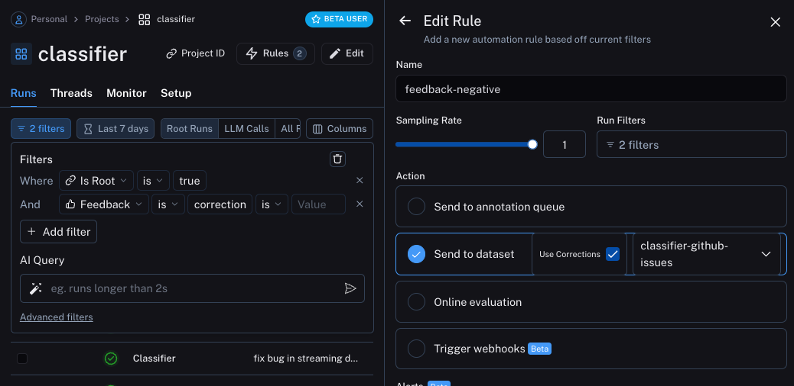
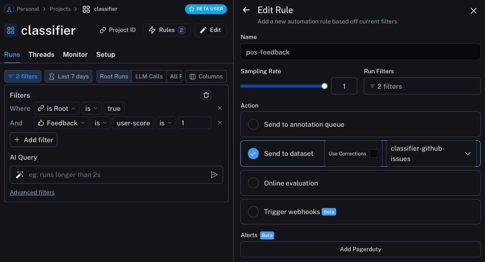

# Optimize a classifier

This tutorial walks through optimizing a classifier based on user a feedback.
Classifiers are great to optimize because its generally pretty simple to collect the desired output, which makes it easy to create few shot examples based on user feedback.
That is exactly what we will do in this example.

## The objective

In this example, we will build a bot that classify GitHub issues based on their title.
It will take in a title and classify it into one of many different classes.
Then, we will start to collect user feedback and use that to shape how this classifier performs.

## Getting started

To get started, we will first set it up so that we send all traces to a specific project.
We can do this by setting an environment variable:

```python
import os
os.environ["LANGCHAIN_PROJECT"] = "classifier"
```

We can then create our initial application. This will be a really simple function that just takes in a GitHub issue title and tries to label it.

```python
import openai
from langsmith import traceable, Client
import uuid

client = openai.Client()

available_topics = [
    "bug",
    "improvement",
    "new_feature",
    "documentation",
    "integration",
]

prompt_template = """Classify the type of the issue as one of {topics}.

Issue: {text}"""

@traceable(
    run_type="chain",
    name="Classifier",
)
def topic_classifier(
    topic: str
):
    return client.chat.completions.create(
        model="gpt-3.5-turbo",
        temperature=0,
        messages=[
            {
                "role": "user",
                "content": prompt_template.format(
                    topics=','.join(available_topics),
                    text=topic,
                )
            }
        ],
    ).choices[0].message.content
```

We can then start to interact with it.
When interacting with it, we will generate the LangSmith run id ahead of time and pass that into this function.
We do this so we can attach feedback later on.

Here's how we can invoke the application:

```python
run_id = uuid.uuid4()
topic_classifier(
    "fix bug in LCEL",
    langsmith_extra={"run_id": run_id}
)
```

Here's how we can attach feedback after.
We can collect feedback in two forms.

First, we can collect "positive" feedback - this is for examples that the model got right.

```python
ls_client = Client()
run_id = uuid.uuid4()

topic_classifier(
    "fix bug in LCEL",
    langsmith_extra={"run_id": run_id}
)

ls_client.create_feedback(
    run_id,
    key="user-score",
    score=1.0,
)
```

Next, we can focus on collecting feedback that corresponds to a "correction" to the generation.
In this example the model will classify it as a bug, whereas I really want this to be classified as documentation.

```python
ls_client = Client()

run_id = uuid.uuid4()
topic_classifier(
    "fix bug in documentation",
    langsmith_extra={"run_id": run_id}
)

ls_client.create_feedback(
    run_id,
    key="correction",
    correction="documentation"
)
```

## Set up automations

We can now set up automations to move examples with feedback of some form into a dataset.
We will set up two automations, one for positive feedback and the other for negative feedback.

The first will take all runs with positive feedback and automatically add them to a dataset.
The logic behind this is that any run with positive feedback we can use as a good example in future iterations.
Let's create a dataset called `classifier-github-issues` to add this data to.



The second will take all runs with a correction and use a webhook to add them to a dataset.
When creating this webhook, we will select the option to "Use Corrections".
This option will make it so that when creating a dataset from a run, rather than using the output of the run
as the gold-truth output of the datapoint, it will use the correction.



Note that these automations only start working for future runs.
So they will not pick up the runs we previously kicked off above - we will need redo those.

## Update the application

We can now update our code to pull down the dataset we are sending runs to.
Once we pull it down, we can create a string with the examples in it.
We can then put this string as part of the prompt!

```python

### NEW CODE ###

# Initialize the LangSmith Client so we can use to get the dataset
ls_client = Client()

# Create a function that will take in a list of examples and format them into a string
def create_example_string(examples):
    final_strings = []
    for e in examples:
        final_strings.append(f"Input: {e.inputs['topic']}\n> {e.outputs['output']}")
    return "\n\n".join(final_strings)

### NEW CODE ###


client = openai.Client()

available_topics = [
    "bug",
    "improvement",
    "new_feature",
    "documentation",
    "integration",
]

prompt_template = """Classify the type of the issue as one of {topics}.

Here are some examples:

{examples}

Begin!

Issue: {text}
>"""

@traceable(
    run_type="chain",
    name="Classifier",
)
def topic_classifier(
    topic: str
):
    # We can now pull down the examples from the dataset
    # We do this inside the function so it always get the most up-to-date examples,
    # But this can be done outside and cached for speed if desired
    examples = list(ls_client.list_examples(dataset_name="classifier-github-issues"))  # <- New Code
    example_string = create_example_string(examples)

    return client.chat.completions.create(
        model="gpt-3.5-turbo",
        temperature=0,
        messages=[
            {
                "role": "user",
                "content": prompt_template.format(
                    topics=','.join(available_topics),
                    text=topic,
                    examples=example_string,
                )
            }
        ],
    ).choices[0].message.content
```

If now run the application with a similar input as before, we can see that it correctly learns that anything related to docs (even if a bug) should be classified as `documentation`

```python
ls_client = Client()

run_id = uuid.uuid4()
topic_classifier(
    "address bug in documentation",
    langsmith_extra={"run_id": run_id}
)
```

## Semantic search over examples

One additional thing we can do is only use the most semantically similar examples.
This is useful when you start to build up a lot of examples.

In order to do this, we can first define an example to find the `k` most similar examples:

```python
import numpy as np

def find_similar(examples, topic, k=5):
    inputs = [e.inputs['topic'] for e in examples] + [topic]
    embedds = client.embeddings.create(input=inputs, model="text-embedding-3-small")
    embedds = [e.embedding for e in embedds.data]
    embedds = np.array(embedds)
    args = np.argsort(-embedds.dot(embedds[-1])[:-1])[:5]
    examples = [examples[i] for i in args]
    return examples
```

We can then use that in the application

```python
ls_client = Client()

def create_example_string(examples):
    final_strings = []
    for e in examples:
        final_strings.append(f"Input: {e.inputs['topic']}\n> {e.outputs['output']}")
    return "\n\n".join(final_strings)


client = openai.Client()

available_topics = [
    "bug",
    "improvement",
    "new_feature",
    "documentation",
    "integration",
]

prompt_template = """Classify the type of the issue as one of {topics}.

Here are some examples:

{examples}

Begin!

Issue: {text}
>"""

@traceable(
    run_type="chain",
    name="Classifier",
)
def topic_classifier(
    topic: str
):
    examples = list(ls_client.list_examples(dataset_name="classifier-github-issues"))
    examples = find_similar(examples, topic)
    example_string = create_example_string(examples)

    return client.chat.completions.create(
        model="gpt-3.5-turbo",
        temperature=0,
        messages=[
            {
                "role": "user",
                "content": prompt_template.format(
                    topics=','.join(available_topics),
                    text=topic,
                    examples=example_string,
                )
            }
        ],
    ).choices[0].message.content
```
