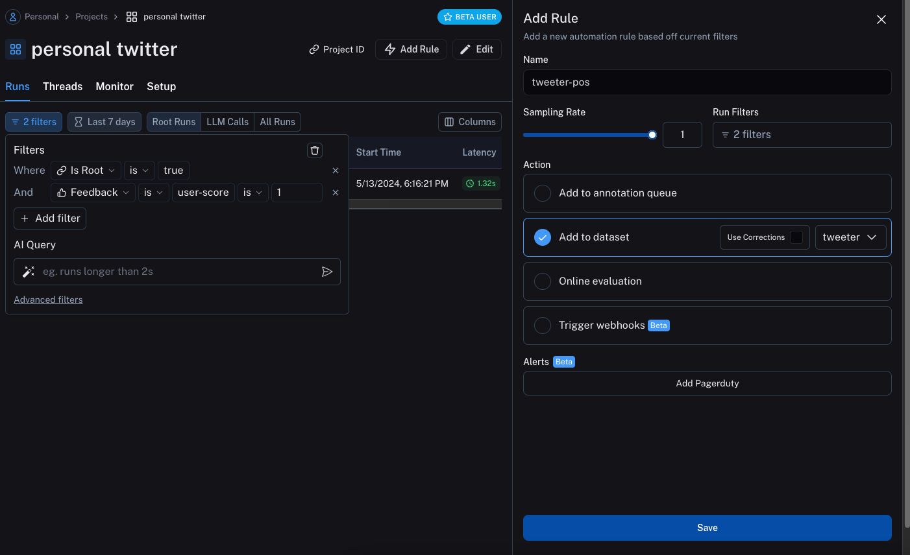
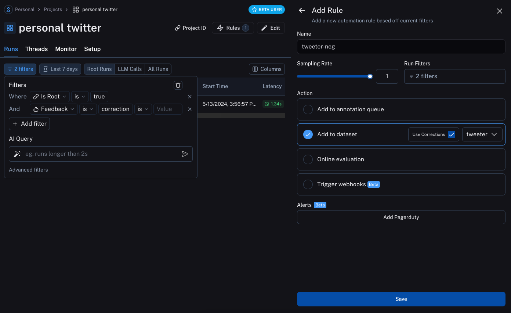

# User-level personalization

This tutorial walks through how to use LangSmith to help build an LLM powered application that is personalized for each user.
Personalizing an application for each user can make the experience feel more unique and "correct" for each user,
increasing adoption and retention.
There are many forms of personalization.
Here we focus on one that uses feedback on previous interactions to improve and personalize its responses over time.
It is very similar to the [optimization](../optimize_classifier) tutorial, but rather than optimizing a system globally it does it for each user individually.

## The objective

In this example, we will build a bot that generates tweets based on a topic.
It will take in a topic and generate a tweet.
Then, we will start to collect user feedback and use that to shape how this bot performs.

## Getting started

To get started, we will first set it up so that we send all traces to a specific project.
We can do this by setting an environment variable:

```python
import os
os.environ["LANGCHAIN_PROJECT"] = "tweeter"
```

We can then create our initial application.
This will be a really simple function that just takes in a topic and generates a tweet.

```python
import openai
from langsmith import traceable, Client
import uuid

client = openai.Client()
ls_client = Client()


prompt_template = """Write a tweet about the following topic:

Topic: {topic}"""

@traceable(
    run_type="chain",
    name="Tweeter",
)
def tweeter(
    topic: str
):
    return client.chat.completions.create(
        model="gpt-3.5-turbo",
        temperature=0,
        messages=[
            {
                "role": "user",
                "content": prompt_template.format(
                    topic=topic,
                )
            }
        ],
```

We can then start to interact with it.
When interacting with it, we will generate the LangSmith run id ahead of time and pass that into this function.
We do this so we can attach feedback later on.
We will also pass in a user ID so we can know which generations came from which user.

Here's how we can invoke the application:

```python
run_id = uuid.uuid4()
tweeter(
    "nba finals",
    langsmith_extra={"run_id": run_id, "metadata": {"user": "foo"}}
)
```

Here's how we can attach feedback after.
We can collect feedback in two forms.

First, we can collect "positive" feedback - this is for examples that the model got right.

```python
run_id = uuid.uuid4()

tweeter(
    "nba finals",
    langsmith_extra={"run_id": run_id, "metadata": {"user": "foo"}}
)

ls_client.create_feedback(
    run_id,
    key="user-score",
    score=1.0,
)
```

Next, we can focus on collecting feedback that corresponds to a "correction" to the generation.
These are super valuable pieces of feedback to collect, because they identify places where the bot could improve.

```python
run_id = uuid.uuid4()
tweeter(
    "nba finals",
    langsmith_extra={"run_id": run_id, "metadata": {"user": "foo"}}
)

ls_client.create_feedback(
    run_id,
    key="correction",
    correction="nba finals... what a snooze fest... nuggets too good, no chance they lose"
)
```

## Set up automations

We can now set up automations to move examples with feedback of some form into a dataset.
We will set up two automations, one for positive feedback and the other for negative feedback.

The first will take all runs with positive feedback and automatically add them to a dataset.
The logic behind this is that any run with positive feedback we can use as a good example in future iterations.
Let's create a dataset called `tweeter` to add this data to.



The second will take all runs with a correction and use a webhook to add them to a dataset.
When creating this webhook, we will select the option to "Use Corrections".
This option will make it so that when creating a dataset from a run, rather than using the output of the run
as the gold-truth output of the datapoint, it will use the correction.




Note that these automations only start working for future runs.
So they will not pick up the runs we previously kicked off above - we will need redo those.
After kicking them off and leaving feedback, we will need to wait a few minutes for the automations to run (they run every five minutes).

## Update the application

We can now update our code to pull down the dataset we are sending runs to.
Once we pull it down, we can create a string with the examples in it.
We can then put this string as part of the prompt!

```python

### NEW CODE ###

# Import a helper that will let us get information about the metadata of a run
from langsmith.run_helpers import get_current_run_tree

# Initialize the LangSmith Client so we can use to get the dataset
ls_client = Client()

# Create a function that will take in a list of examples and format them into a string
def create_example_string(examples):
    final_strings = []
    for e in examples:
        final_strings.append(f"Topic: {e.inputs['topic']}\n> {e.outputs['output']}")
    return "\n\n".join(final_strings)

### NEW CODE ###


client = openai.Client()


prompt_template = """Write a tweet about the following topic.

Make it in a similar style & tone as the following examples:

{examples}

Begin!

Topic: {text}
>"""

@traceable(
    run_type="chain",
    name="Tweeter",
)
def tweeter(
    topic: str,
):
    # Get the current run tree, this will let us access metadata of the run
    rt = get_current_run_tree()
    # Construct some metadata to filter on, in this case the user ID
    metadata_to_filter = {"user": rt.metadata['user']}
    # We can now pull down the examples from the dataset
    # We do this inside the function so it always get the most up-to-date examples,
    # But this can be done outside and cached for speed if desired
    examples = list(ls_client.list_examples(dataset_name="tweeter", metadata=metadata_to_filter))  # <- New Code
    example_string = create_example_string(examples)

    return client.chat.completions.create(
        model="gpt-3.5-turbo",
        temperature=0,
        messages=[
            {
                "role": "user",
                "content": prompt_template.format(
                    text=topic,
                    examples=example_string,
                )
            }
        ],
    ).choices[0].message.content
```

If now run the application with the same user ID as before, we can see that it learns from the example and generates a tweet more in that style.

```python
run_id = uuid.uuid4()
tweeter(
    "nhl finals",
    langsmith_extra={"run_id": run_id, "metadata": {"user": "foo"}}
)
```

We can also pass in a different user ID and see that the tweet it generates is back to the original style.

```python
run_id = uuid.uuid4()
tweeter(
    "nhl finals",
    langsmith_extra={"run_id": run_id, "metadata": {"user": "bar"}}
)
```

We could then make another correction, this time for that different user:

```python
ls_client.create_feedback(
    run_id,
    key="correction",
    correction="OMG THESE NHL FINALS ARE THE BESTTTTT"
)
```

If we wait a few minutes for the automations to run, we'll see that we can now generate pretty distinctive tweets for each user.
Let's take a look at some examples:

A brand new user (generic tweet style):

```python
run_id = uuid.uuid4()
tweeter(
    "superbowl",
    langsmith_extra={"run_id": run_id, "metadata": {"user": "baz"}}
)
```

The first user (`foo`) which has more of a chill, all lowercase style:

```python
run_id = uuid.uuid4()
tweeter(
    "superbowl",
    langsmith_extra={"run_id": run_id, "metadata": {"user": "foo"}}
)
```

The second user (`bar`) which has more of an excited, all caps style:

```python
run_id = uuid.uuid4()
tweeter(
    "superbowl",
    langsmith_extra={"run_id": run_id, "metadata": {"user": "bar"}}
)
```