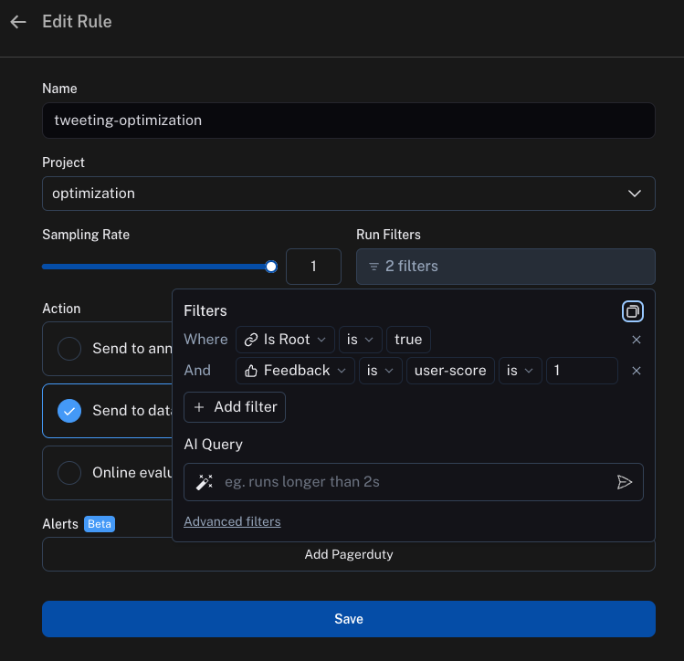
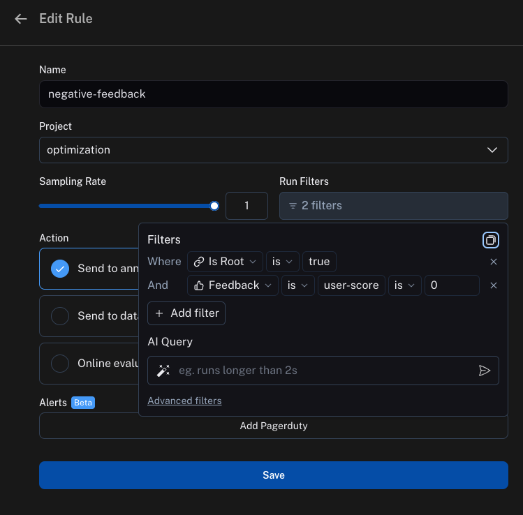

# Optimization

This walks through a specific use case.
In this guide, we will create an application that we optimize over time.
We will do this by collecting user feedback and then using that to collect few shot example datasets.
We can then pull those few shot example datasets into the application at run time and use those as examples of how the application should behave.

## The objective

In this example, we will build a bot that can write tweets.
We will start with a generic prompt, and then by leaving feedback on tweets we can start to build up a few shot example dataset.
We will do this without any LangChain code, just using raw OpenAI and LangSmith

## Getting started

To get started, we will first set it up so that we send all traces to a specific project.
We can do this by setting an environment variable:

```python
import os
os.environ["LANGCHAIN_PROJECT"] = "optimization"
```

We can then create our initial application. This will be a really simple function that just takes in a topic and creates a tweet about it.

```python
import openai
from langsmith import traceable, Client
import uuid

client = openai.Client()

@traceable(
    run_type="chain",
    name="Tweeter",
)
def tweeter(
    topic: str
):
    return client.chat.completions.create(
        model="gpt-3.5-turbo",
        messages=[{"role": "user", "content": f"Write a tweet about {topic}"}],
    ).choices[0].message.content
```

We can then start to interact with it.
When interacting with it, we will generate the LangSmith run id ahead of time and pass that into this function.
We do this so we can attach feedback later on.

Here's how we can invoke the application:

```python
run_id = uuid.uuid4()
tweeter(
    "football",
    langsmith_extra={"run_id": run_id}
)
```

Here's how we can attach feedback after:

```python
ls_client = Client()

ls_client.create_feedback(
    run_id,
    key="user-score",
    score=1.0,
)
```

We can set a score of `1` when we liked the tweet, and a score of `0` when we don't like the tweet.
Note that you could easily incorporate this into a UI to gather feedback in a more user friendly manner.

## Set up automations

We can now set up two automations.

The first will take all runs with positive feedback and automatically add them to a dataset.
The logic behind this is that any run with positive feedback we can use as a good example in future iterations.



The second will take all runs with negative feedback and automatically send them to an annotation queue.
The logic behind this is that we can then have human reviewers looking at that annotation queue and correcting any bad examples to better ones.
After correcting them, they can then send them to the same dataset.



## Updating the application

We can now update our code to pull down the dataset we are sending runs to.
We can use the datapoints in that dataset as few shot examples.

```python
@traceable(
    run_type="chain",
    name="Tweeter",
)
def tweeter(
    topic: str
):
    examples = list(ls_client.list_examples(dataset_name="tweeting-optimization"))
    example_string = "\n\n".join([f"Input: {e.inputs['topic']}\nOutput: {e.outputs['output']}" for e in examples])
    return client.chat.completions.create(
        model="gpt-3.5-turbo",
        messages=[{"role": "user", "content": f"Write a tweet about {topic}. Here are some examples of how to do this well:\n\n{example_string}"}],
    ).choices[0].message.content
```
